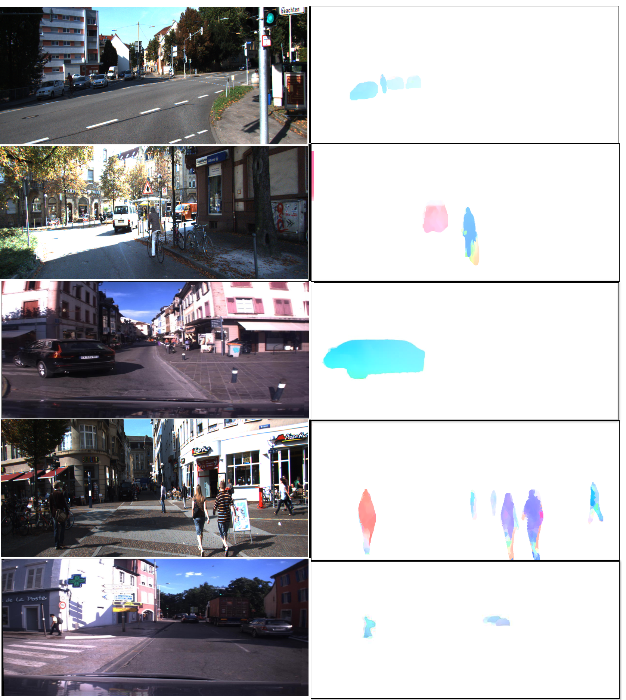

# Semantic-Aware Object Identification in Urban Driving Scenarios

The motivation for our work stems from the fact that, while driving, humans identify each object in the scene, and their cognition system allows them to infer all the information, such as the objects' status, whether they are static or moving; objects' distance estimation, which indicates how far they are from the driving vehicle; and, if the objects are moving, what is their position and direction, among other things. When combined with existing knowledge such as traffic rules and knowledge obtained from previous experiences, this information aids in the interpretation of the situation, which in turn acts as the basis for decision-making.

Through the use of vision-based techniques, we hope to develop a framework that can extract all the information needed for the identification of object elements in an urban driving scenario. This includes object class identification, object status (whether moving or stationary), position information, motion and movement data as well as depth and distance information from a moving camera. It is feasible to account for critical situations, evaluate the likely path of moving objects, and estimate collision or possible threat warnings while driving if you have access to this information.

Please refer to our [paper]() for more details on the method and experimental results on both KITTI and EU-Life Long datasets

Our work contributes

- Item 1 A noval deep model for moving object detection [TSAE-MOD-Net]() is developed by integrating an encoder-decoder network with a segmentation network. 

- Item 2 A new dataset for Moving Object Detection build from existing driving datasets [KITTI](http://www.cvlibs.net/datasets/kitti/raw_data.php) and [EU long-term](https://epan-utbm.github.io/utbm_robocar_dataset/), covering dynamic objects like all types of vehicles, pedestrians, bicyclists, and motorcyclists.

- Item 3 Propose to use image registration as a tool for ego-motion compensation for urban driving scenes.

- Item 4 Proposal of a new framework for object identification (FOI) from a moving camera in the complex urban driving environment which extracts the complete information related to the object, including its class, status (moving/static), direction, velocity, position, and distance from the ego vehicle.

# Code

[Codes]() will soon be available.

# Downloads

Click [here]() to download the Object Semantic Information annotaions (.json files).  
Click [here](https://github.com/epan-utbm/Moving-Object-Detection-Dataset) to download the MOD dataset.
 

# Citing our work
If you find this work useful, please cite our papers: 

Paper [FOI]() 
Paper [TSAE-MOD-Net]()  
Paper [MOD dataset]()  

## Expriment Result TSAE-MOD-Net 

## Expriment Result Ego-Motion Compensation 

## Expriment Result Object Identification 

# Acknowledgements
University Technology Belfort-Montbrliard, France [UTBM](https://www.utbm.fr/) 
Connaissance et Intelligence Artificielle Distribuées [CIAD](http://www.ciad-lab.fr/) 
EPAN Research Group at UTBM [EPAN](https://epan-utbm.github.io/) 

# Inspiration
We hope that this will benefit the community and researchers working in the field of autonomous driving.